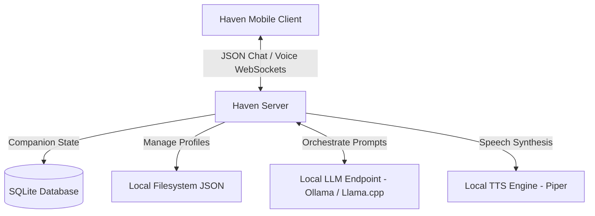

# Haven Server 🌸

**Haven Server** is the high-performance C# backend orchestrator and gateway for the **Haven AI Companion** ecosystem. Powered by ASP.NET Core, SQLite, and local AI engines, Haven Server coordinates character prompt layouts, handles mobile pairing sessions, and hosts the real-time WebSocket communication pipelines that power the mobile client.

<p align="center">
  
</p>

---

## 🚀 Core Capabilities

*   **Multi-Companion Engine**:
    *   Loads and manages companion profiles (JSON configurations) dynamically.
    *   Supports client-side parsing and importing of standard **[Tavern Character Cards (PNG)](TAVERN_CARDS.md)**.
    *   **Prompt-Split Logic**: Automatically parses incoming message payloads, separating custom companion instructions from user messages before passing them to the underlying LLM as clean system/user message blocks.
*   **Secure Mobile Pairing**:
    *   Tracks long-lived pairing connections in a persistent SQLite database (`paired_devices`).
    *   Provides token-based authentication for linked mobile devices.
    *   Features a built-in admin dashboard to immediately inspect active mobile sessions and revoke pairing access.
*   **Real-Time Voice Streaming Gateway**:
    *   Hosts low-latency WebSocket endpoint `/ws/voice/{characterId}` for hands-free vocal communication.
    *   Streams incoming speech data directly to local Text-To-Speech (TTS) pipelines for immediate audio playback.
*   **Admin Telemetry Console**:
    *   Provides live process resources diagnostics (C# RAM working set footprint, active thread counts, garbage collector heap allocation).
    *   Includes a responsive web dashboard (`admin.html` and `index.html`) to manage companion profiles and oversee system resources.
*   **Cross-Platform Service Installer**:
    *   Built-in cross-platform self-installer supports running Haven Server as a persistent system daemon:
        *   **Windows**: Windows Service Control Manager (`sc.exe`).
        *   **Linux**: `systemd` service unit configuration.
        *   **macOS**: `launchd` daemon configurations.

---

## 🏗️ Technical Architecture



---

## 🛠️ Getting Started

### 1. Requirements
*   [.NET 10.0 Runtime / SDK](https://dotnet.microsoft.com/download)
*   A local LLM host (e.g., [Ollama](https://ollama.ai) or llama.cpp) running our recommended **[Gemma 4 E4b Merged (Turbo) GGUF](https://huggingface.co/ssfdre38/gemma4-e4b-merged-iq4xs-turbo)**.
*   *(Optional)* A Stable Diffusion local API server (e.g., `sd-server.exe`) for companion image generation.

### 2. Configure Server Settings
Before starting the server, rename `appsettings.json.example` to `appsettings.json` and configure your local LLM models and API endpoints:
```json
{
  "Logging": {
    "LogLevel": {
      "Default": "Information"
    }
  },
  "Ollama": {
    "BaseUrl": "http://localhost:11434",
    "Model": "gemma4-turbo:latest"
  },
  "TTS": {
    "Engine": "Piper",
    "Voice": "en_US-amy-medium.onnx"
  }
}
```

### 3. Run the Server
To build and run in the foreground:
```bash
dotnet run --project haven-server-cs.csproj
```
The server will start hosting the web panel and APIs locally at:
*   **`http://localhost:18799`**
*   *Dashboard*: `http://localhost:18799/admin.html`
*   *Chat Client*: `http://localhost:18799/index.html`

---

## 📦 Windows Unified Installation

To deploy Haven Server locally as a Windows service alongside an optional local image generator:

1. Open PowerShell as **Administrator**.
2. Navigate to the server directory and run:
   ```powershell
   .\setup.ps1
   ```
3. The setup wizard will:
   *   Copy files to your target system folder (e.g., `C:\Program Files\HavenServer`).
   *   Ask if you want to install and configure the **Stable Diffusion local server (`sd-server.exe`)** alongside Haven.
   *   Optionally register and start **Haven Server** as a persistent Windows Service.

---

## 🛡️ License

This project is licensed under the MIT License - see the LICENSE file for details.
